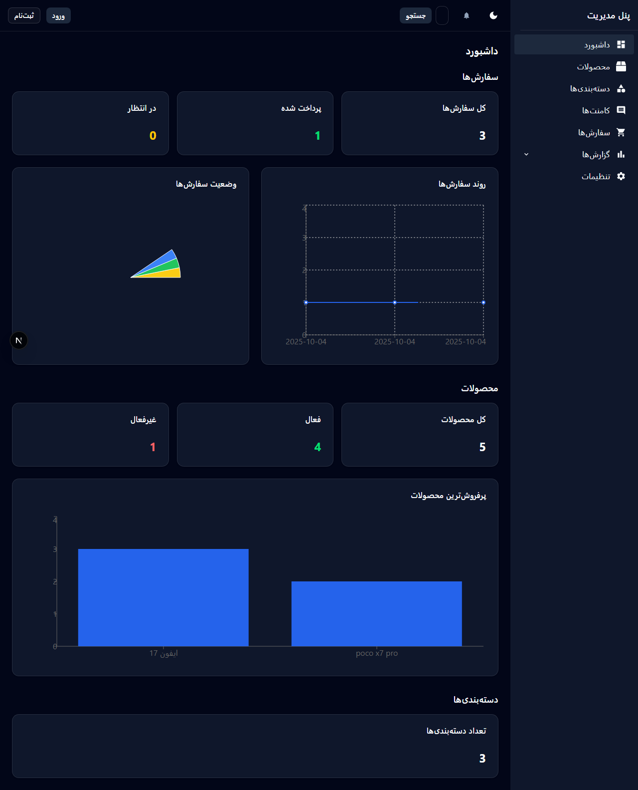
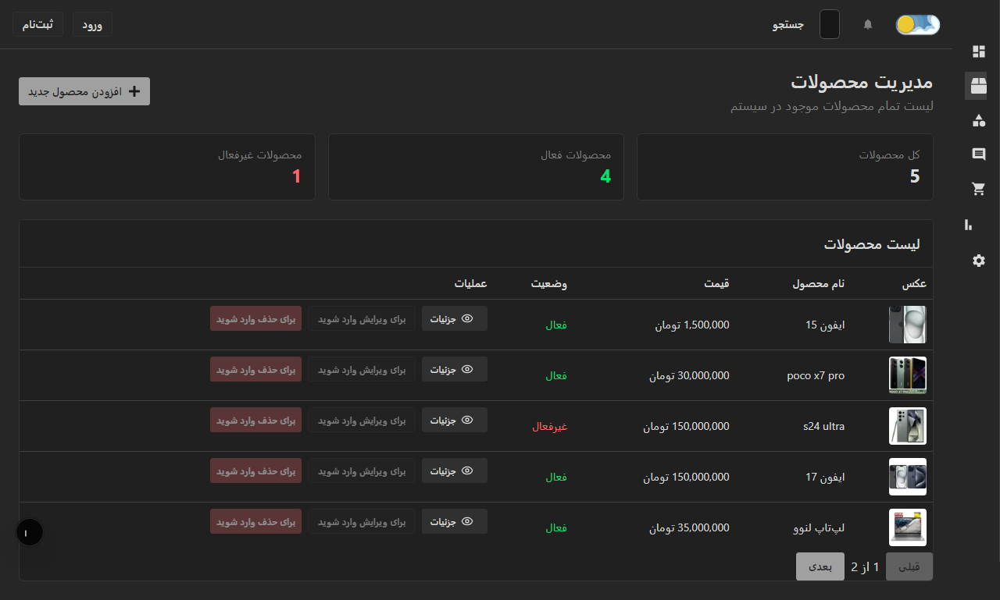

# CMSNextP2 – پنل مدیریت فارسی (RTL) با Next.js 15

[](https://nextjs.org/)
[](https://www.prisma.io/)
[](https://www.postgresql.org/)
[](https://tailwindcss.com/)
[](https://clerk.com/)

یک **پنل مدیریت مدرن و راست‌چین (RTL-first)** برای CMS و فروشگاه آنلاین، ساخته‌شده با **Next.js 15، Prisma و PostgreSQL**.  
امعماری سه‌لایه (Presentation → Application → Infrastructure) را پیاده‌سازی می‌کند.

---

## 🖼 تصاویر دمو

### داشبورد



### محصولات



---

## 🌐 نمایش زنده

[مشاهده دمو آنلاین](https://cmsnextp2.vercel.app/) 🚀

---

## 🚀 تکنولوژی‌ها و ابزارها

- [Next.js 15 (App Router)](https://nextjs.org/docs/app) — فریم‌ورک React SSR/ISR/SSG
- [TypeScript (strict)](https://www.typescriptlang.org/)
- [Prisma ORM](https://www.prisma.io/) + [PostgreSQL](https://www.postgresql.org/)
- [Tailwind CSS v4 (RTL)](https://tailwindcss.com/)
- [shadcn/ui](https://ui.shadcn.com/) (Table, Dialog, Form, ...)
- [React Hook Form](https://react-hook-form.com/) + [Zod](https://zod.dev/) (اعتبارسنجی فرم)
- [Clerk](https://clerk.com/) (احراز هویت و محافظت از مسیرها)
- [Zustand](https://zustand-demo.pmnd.rs/) (state management)
- [Sonner](https://sonner.emilkowal.ski/) (toast notifications)
- [Lucide React](https://lucide.dev/) و [React Icons](https://react-icons.github.io/react-icons/)
- [Recharts](https://recharts.org/) (نمودارها و داشبورد)
- [Husky](https://typicode.github.io/husky/) (pre-commit hooks)
- [Turbopack](https://turbo.build/pack) (dev/build)

---

## ✨ ویژگی‌های کلیدی

- 🎨 **RTL-first UI** با تم تاریک/روشن
- 🔐 **Granular Access Control**: مشاهده آزاد، CRUD فقط برای کاربران لاگین‌شده
- 📊 **داشبورد تحلیلی** با Recharts و KPI
- 🧩 **کامپوننت‌های ماژولار** (Table, Form, Dialog, Pagination)
- 🔔 **سیستم نوتیفیکیشن یکپارچه** (Sonner + Zustand)
- 🛠 **معماری سه‌لایه**: جداسازی کامل UI، منطق دامنه و دیتابیس
- 🚀 **SEO & Performance**: SSR, ISR, SSG

---

## 📁 ساختار پروژه

```
src/
├── app/ (admin routes, api, auth pages)
├── components/ (ui, layout, features)
├── application/ (business logic & services)
├── lib/ (utils, validation, prisma client)
├── stores/ (zustand)
├── prisma/ (schema & migrations)
└── public/ (assets)
```

---

## 🔒 احراز هویت و دسترسی

- Clerk برای مدیریت Auth و Middleware
- Public: مشاهده محصولات، سفارشات، نظرات
- Protected: CRUD فقط برای کاربران لاگین‌شده
- Role-based Extensibility آماده (قابل توسعه برای Admin/Editor/Viewer)

---

## 🛠 راه‌اندازی

```bash
git clone <repo>
cd cmsnextp2
npm install
cp .env.example .env   # Clerk & DATABASE_URL
npx prisma migrate dev
npm run dev
```

بعد از اجرای این دستورات، پروژه روی http://localhost:3000 بالا میاد ✅

---

## 📊 مدل‌های دیتابیس (Prisma)

- Product, Order, Category, Comment
  (با روابط و اعتبارسنجی کامل)

---

## 📝 نکات رزومه

- معماری مدرن و ماژولار
- RTL-first Design
- Granular Access Control
- DRY Skeletons & Loading States
- CI/CD با Husky + Vercel

---

## 📄 لایسنس

MIT

---

## 👤 توسعه‌دهنده

[@simurgh420](https://github.com/simurgh420)
<br/>
📫 How to reach me: mohamadrezah420@gmail.com
